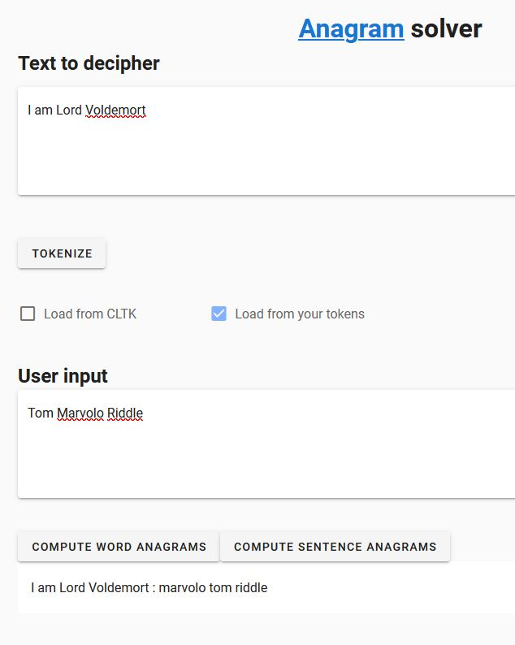

# Anagram solver

## Installation

Used with Python 3.6 and above.

```bash
$ pip install -r requirements.txt
$ cd vue/anagramme
$ npm install
```

Instead of npm, you can use yarn.

```bash
$ pip install -r requirements.txt
$ cd vue/anagramme
$ yarn install
```

## How to use

Open a terminal.
```
$ python run.py
```

Open an other terminal.
```
$ cd vue/anagramme
$ npm run # or yarn serve
```

## Example



